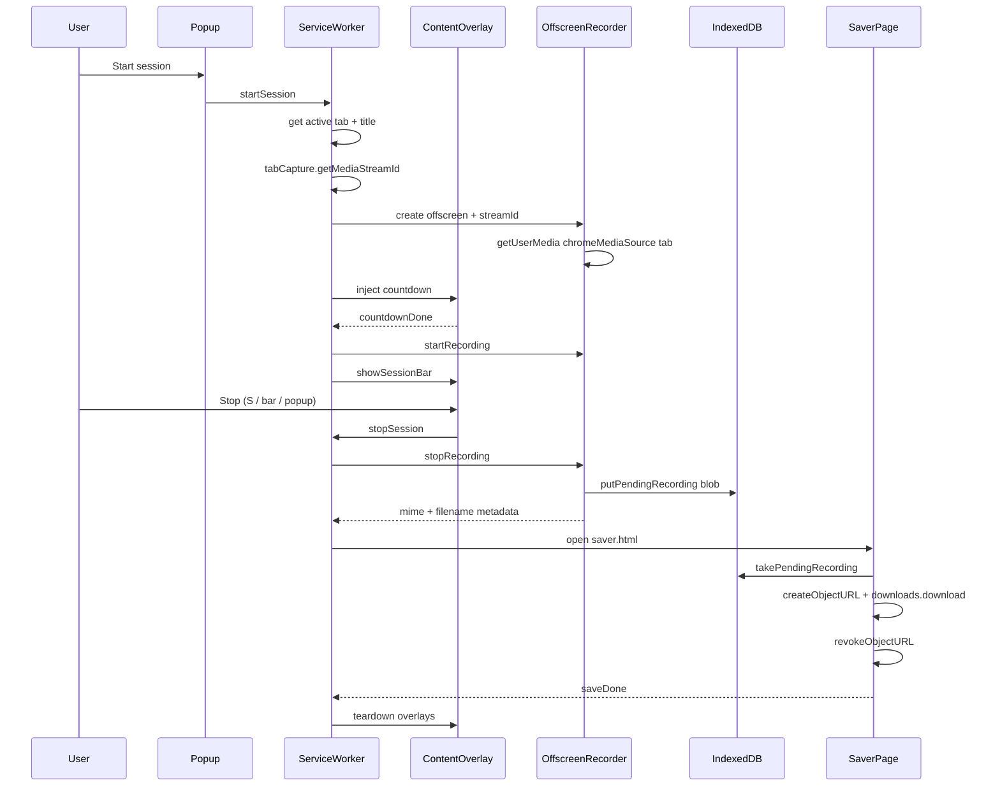

# Exergy Connect

# Exergy ∞ xFrame 

**Intent captured.**

Creating a video from a browser session shouldn't require a desktop screen share, a heavyweight recording suite, or a professional degree.

Exergy ∞ xFrame records the current browser tab—including video and tab audio—into a shareable MP4 using simple controls. It can also take a quick PNG snapshot of the visible tab. Record. Snapshot. Share.

Built on standard browser capabilities, xFrame stays small, fast, and easy to understand.

An animated explainer is available in [`index.html`](https://exergy-connect.github.io/xFrame-plugin/).

## Why xFrame?

A recording is only one materialization.

The purpose of xFrame is to communicate concepts. Recording a browser session is simply the first realization of **Conceptual Twinning**—capturing intent so it can be shared, explained, and transformed.

Today xFrame produces an MP4—or a PNG snapshot of what you see.

Tomorrow the same conceptual frame could produce:

- Documentation
- Tutorials
- Design reviews
- AI context
- Workflow artifacts

The recording is not the product.

It is the first conceptual twin.

## Features

- Record the current browser tab
- Optional tab audio capture together with video
- Video quality presets (Efficient / Standard / High) plus **Optimize for LinkedIn** (~6 Mbps, prefer H.264)
- Save directly as MP4
- Take a snapshot of the visible tab (full viewport or a selected region), with optional LinkedIn 1280×644 sizing and PNG/JPG/GIF output
- Customize the recording logo
- Lightweight implementation using standard browser APIs
- No desktop recording
- No unnecessary UI
- Optional recording controls (popup or keyboard shortcuts)
- Optional mouse pointer overlay

Typical recordings are approximately **0.25–1 MB/s** depending on the quality preset, resolution, motion, and whether audio is included (Efficient ≈ 2 Mbps video; Standard ≈ 5 Mbps; High ≈ 8 Mbps).

## Philosophy

**Less is different.**

Rather than capturing everything, Exergy ∞ xFrame helps you focus on what matters.

**Communicate with clear intent.**

## Load unpacked

1. Open Chrome → **Extensions** → enable **Developer mode**
2. Click **Load unpacked**
3. Select the [`extension/`](extension/) directory in this repository

## Capture a session

1. Open the website tab you want to capture
2. Click the Exergy ∞ xFrame toolbar icon
3. Choose options, then **Start session**
4. Watch the on-page countdown (3 → 2 → 1)
5. Work as usual; pause or stop when done
6. The recording downloads as `{tab title} {YYYY-MM-DD HH_MM}.mp4` (or `.webm` if MP4 is unavailable)

### Start options

| Option | Default | Effect |
| --- | --- | --- |
| Include logo in recording | On | Watermark in the top-right (Exergy by default; choose a custom image in the popup) |
| Hide recording controls from the video | On | Omits the on-page session bar from the recording; reopen the popup (or use keys) to pause/stop |
| Include mouse pointer in recording | Off | Draws a captureable pointer overlay; otherwise the cursor is hidden from the capture |
| Include tab audio in recording | On | Captures tab audio with the video; turn off for silent recordings |
| Optimize for LinkedIn | Off | Selects the LinkedIn quality profile (~6 Mbps) and prefers H.264 + AAC for upload-friendly MP4 |
| Video quality | Standard (~5 Mbps) | Efficient (~2 Mbps), Standard (~5 Mbps), or High (~8 Mbps); locked to LinkedIn when that option is on |

Recording and snapshot settings live on separate popup tabs (**Record** / **Snapshot**) so the popup stays compact. A custom recording logo is stored in extension storage and reused until you reset to the Exergy logo. Audio and quality preferences are remembered between sessions.

### During a session

- **P** — pause / continue
- **S** — stop & save
- Reopen the toolbar popup for the live timer plus Pause and Stop & save
- If “Hide recording controls” is off, the on-page session bar also offers pause/stop

Keys are ignored while typing in inputs, textareas, or contenteditable fields.

Chrome only (Manifest V3). Restricted pages such as `chrome://` URLs cannot be captured.

## Take a PNG snapshot

1. Open the website tab you want to capture
2. Click the Exergy ∞ xFrame toolbar icon (or press **Alt+Shift+S**)
3. Choose **Visible tab** or **Select region**, a delay (default 5 seconds), and optional LinkedIn / JPG output settings
4. Click **Take snapshot** (or use the shortcut with saved preferences)
5. After the countdown, the image downloads; in region mode, drag a rectangle first (Esc cancels)

The file is saved as `{tab title} {YYYY-MM-DD HH_MM}.png` (or `.jpg` / `.gif` by format).

### Snapshot options

| Option | Default | Effect |
| --- | --- | --- |
| Capture | Visible tab | Full visible viewport, or drag to select a subsection |
| Delay | 5 seconds | On-page countdown before capture (None / 3 / 5 / 10) |
| Optimize for LinkedIn | Off | Center-crops and scales to LinkedIn’s 1280×644 feed size |
| Format | PNG | Output as PNG, JPG (95% quality), or GIF (256-color indexed) |

Preferences are stored in extension storage and reused by the **Alt+Shift+S** shortcut. Remap the shortcut under `chrome://extensions/shortcuts`. Snapshots are blocked while a recording session is active (and the reverse).

## How a session works

Start acquires the tab stream and prepares the offscreen recorder before the countdown. Encoding begins only after the countdown finishes so the digits are not recorded. Stop writes the recording to IndexedDB, then the service worker downloads it.

1. **Start** — The popup asks the service worker to begin a session on the active tab (with the chosen options).
2. **Acquire** — The worker obtains a `tabCapture` stream id, opens an offscreen document, and the recorder calls `getUserMedia` with the tab media source (video, plus tab audio when enabled). Tab audio is also routed to the local `AudioContext` so you can still hear the page. Capture requests `cursor: never` unless “Include mouse pointer” is on, and aims for 30 fps.
3. **Countdown** — A content overlay counts down for about three seconds.
4. **Record** — After the overlay clears, `MediaRecorder` starts with the chosen quality bitrates (MP4 when the browser can actually record it; otherwise WebM). Tab audio is captured only when enabled. The native cursor is hidden on the page; optional logo / pointer overlays and session UI follow the start options.
5. **Stop & save** — The offscreen recorder stores the blob in IndexedDB. A short-lived `saver.html` page (needed because service workers lack `URL.createObjectURL`) reads the blob, downloads it via `chrome.downloads`, revokes the URL, and closes.

### Implementation notes

- Declares `host_permissions` for `<all_urls>` so `tabCapture.getMediaStreamId` can target the active tab reliably (in addition to `activeTab` from the popup gesture).
- LinkedIn snapshot optimization center-crops into 1280×644 after capture (and after an optional region crop). Output format can be PNG, JPG (95%), or GIF (single-frame, ≤256 colors).
- Prefer native `MediaRecorder` MP4 (`video/mp4`). If MP4 is advertised but fails to start, or is unsupported, the extension falls back to WebM and uses a `.webm` extension.
- Recordings move offscreen → IndexedDB → `saver.html` → `chrome.downloads` (not Base64 data URLs, and not `createObjectURL` in the service worker). The saver page revokes the temporary `blob:` URL after the download completes.
- No npm runtime dependencies; the extension is plain HTML/CSS/JS.

## Chrome Web Store package

The [`Package Chrome extension`](.github/workflows/package-extension.yml) workflow zips the contents of [`extension/`](extension/) (with `manifest.json` at the archive root) as `exergy∞xframe-<version>.zip`.

- On pushes/PRs to `main`, the zip is uploaded as a workflow artifact
- On a published GitHub Release, the same zip is attached to that release for Chrome Web Store upload

## Brand assets

Packaged under [`extension/assets/`](extension/assets/) from the repo root:

- `favicon.ico`
- `favicon.svg`
- `exergy_connect_logo.png`
